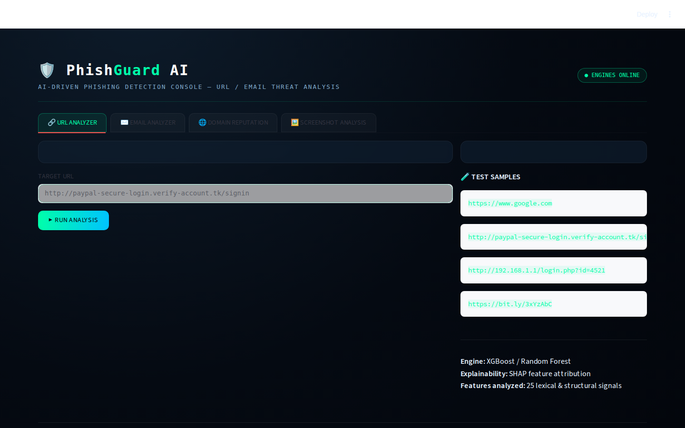
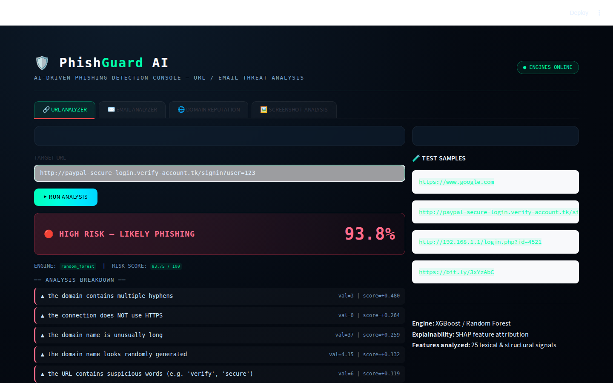
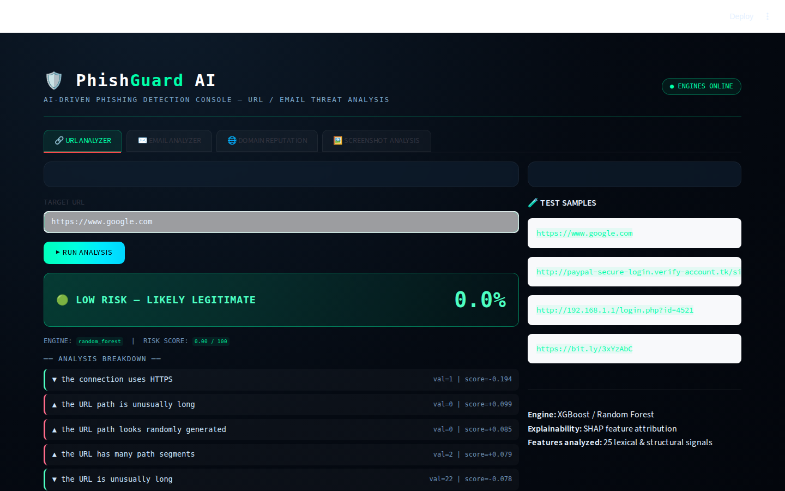
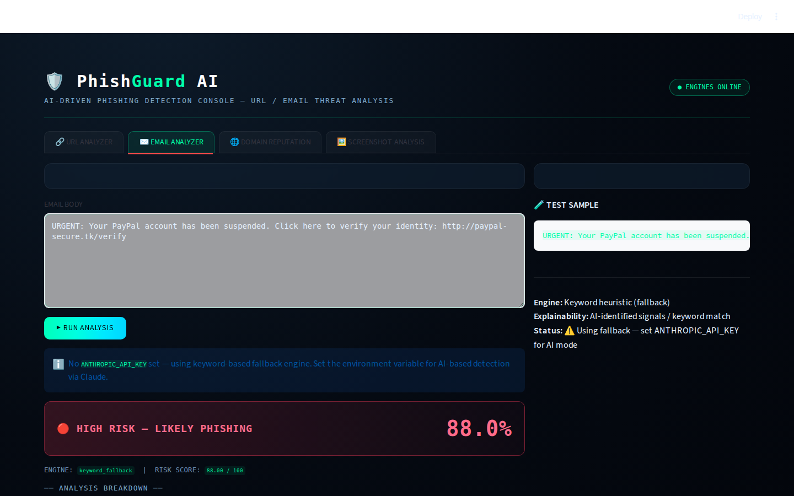
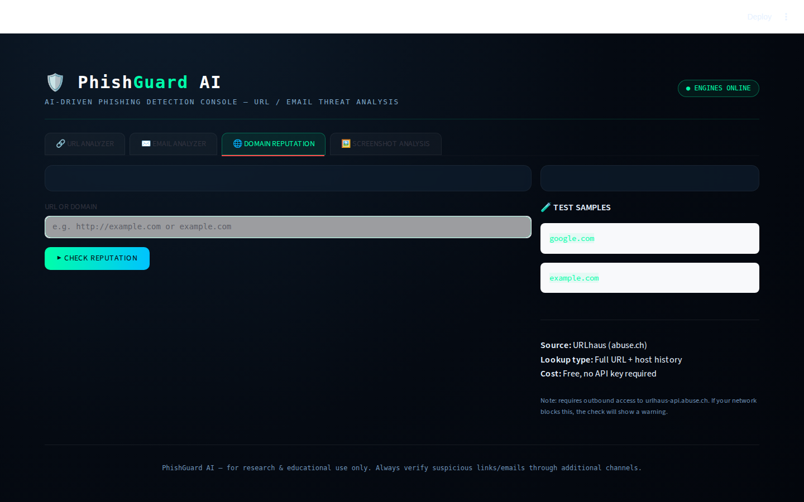
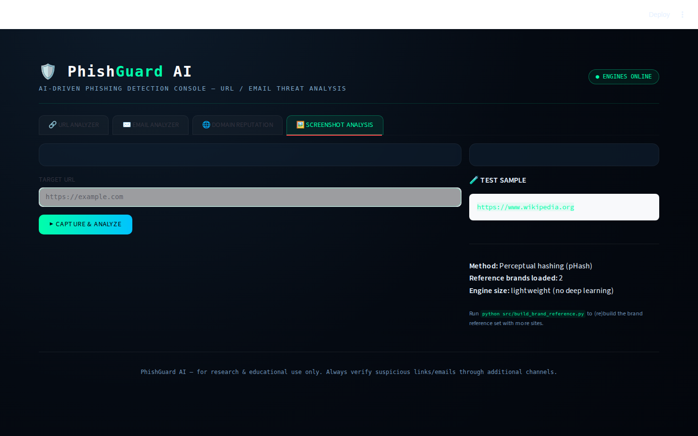

<div align="center">

# 🛡️ PhishGuard AI

**AI-Driven Phishing Detection Platform**

[](https://python.org)
[](https://scikit-learn.org)
[](https://fastapi.tiangolo.com)
[](https://streamlit.io)
[](LICENSE)

URL phishing detection · Email analysis via Claude AI · Domain reputation (URLhaus) · Screenshot brand-similarity · Chrome extension

</div>

---

## 📸 Screenshots

### URL Analyzer — Clean Dashboard


### URL Analyzer — Phishing Detected (93.8% risk)


### URL Analyzer — Legitimate URL (0% risk)


### Email Analyzer — AI Phishing Detection


### Domain Reputation — URLhaus Threat Intel


### Screenshot Analysis — Visual Brand Similarity


---

## ✨ Features

| Feature | Engine | Size |
|---|---|---|
| 🔗 **URL Analyzer** | Random Forest + custom feature attribution | Core |
| ✉️ **Email Analyzer** | Claude API (claude-haiku) / keyword fallback | Core |
| 🌐 **Domain Reputation** | URLhaus (abuse.ch), free, no API key needed | Core |
| 🖼️ **Screenshot Analysis** | Playwright + perceptual hash (pHash) | Optional +280MB |
| 🔌 **Browser Extension** | Chrome MV3, calls FastAPI backend | No extra install |

---

## 🚀 Quick Start

### First-time setup (one command)

**Linux / macOS:**
```bash
git clone https://github.com/dedsechack-1337/PhishGuardAI.git
cd PhishGuardAI
chmod +x setup_and_run.sh run.sh run_api.sh
./setup_and_run.sh
```

**Windows:**
```bat
git clone https://github.com/dedsechack-1337/PhishGuardAI.git
cd PhishGuardAI
setup_and_run.bat
```

The script will:
1. Create a Python virtual environment
2. Install all core dependencies (~510MB)
3. Ask if you want the Screenshot Analysis add-on (+280MB, optional)
4. Generate the URL training dataset
5. Train the Random Forest model
6. Launch the web UI and open your browser

> **First run takes 3–5 minutes.** Subsequent runs use `./run.sh` and launch instantly.

### Every day after that

```bash
./run.sh        # Linux/macOS — just opens the dashboard
run.bat         # Windows
```

---

## 📦 Install Size Breakdown

| Component | Size | Required |
|---|---|---|
| Python core ML (scikit-learn, pandas, numpy) | ~290MB | ✅ Yes |
| Streamlit web UI | ~30MB | ✅ Yes |
| FastAPI + uvicorn | ~8MB | ✅ Yes |
| anthropic SDK | ~2MB | ✅ Yes |
| requests, pillow, imagehash | ~9MB | ✅ Yes |
| **Core total** | **~510MB** | |
| Playwright + Chromium browser | +280MB | Optional |
| **With screenshot add-on** | **~790MB** | |

> XGBoost (~250MB) and SHAP (~340MB) are **not installed by default**.
> Install `requirements-dev.txt` only if you want to retrain with XGBoost.

---

## 🌐 Browser Extension

The Chrome extension scans the page you're currently viewing using the FastAPI backend.

### Install
1. Start the API backend:
   ```bash
   ./run_api.sh    # Linux/macOS
   run_api.bat     # Windows
   ```
   Backend runs at `http://localhost:8000` — docs at `http://localhost:8000/docs`

2. Open Chrome and go to `chrome://extensions/`
3. Enable **Developer mode** (top-right toggle)
4. Click **Load unpacked** and select the `extension/` folder

### Usage
Click the 🛡️ PhishGuard icon in your toolbar on any page → **SCAN THIS PAGE** → instant risk verdict + breakdown.

---

## 🔑 Email Analysis — Claude API Setup

For AI-powered email phishing detection, set your Anthropic API key:

```bash
# Linux/macOS
export ANTHROPIC_API_KEY=sk-ant-...

# Windows
set ANTHROPIC_API_KEY=sk-ant-...
```

Without a key, the email analyzer uses a built-in keyword-based fallback that still catches common phishing patterns.

Get a free API key at [console.anthropic.com](https://console.anthropic.com).

---

## 🖼️ Screenshot Analysis — Optional Add-on

Install after the main setup:

```bash
# Linux/macOS
pip install playwright==1.48.0
python -m playwright install chromium

# Windows (in venv)
venv\Scripts\pip install playwright==1.48.0
venv\Scripts\python -m playwright install chromium
```

Then rebuild the brand reference database (captures screenshots of major brands once):
```bash
python src/build_brand_reference.py
```

Restart the UI — the Screenshot Analysis tab will now be fully functional.

---

## 📂 Project Structure

```
PhishGuardAI/
├── setup_and_run.sh / .bat     # First-time setup + launch
├── run.sh / run.bat            # Daily launch (fast)
├── run_api.sh / run_api.bat    # FastAPI backend for browser extension
├── requirements.txt            # Core deps (~510MB)
├── requirements-screenshot.txt # Screenshot add-on (+280MB)
├── requirements-dev.txt        # Optional: XGBoost for retraining
│
├── src/
│   ├── app.py                  # Streamlit web UI (4 tabs)
│   ├── api.py                  # FastAPI backend (5 endpoints)
│   ├── feature_extraction.py   # 25 URL feature signals
│   ├── train.py                # RF model training pipeline
│   ├── predict.py              # URL inference + explanations
│   ├── predict_email.py        # Email inference (Claude API / fallback)
│   ├── domain_reputation.py    # URLhaus threat intel lookup
│   ├── screenshot_analysis.py  # Playwright capture + pHash comparison
│   ├── build_brand_reference.py# Build brand reference hash database
│   └── generate_dataset.py     # Synthetic URL training dataset
│
├── extension/                  # Chrome browser extension (MV3)
│   ├── manifest.json
│   ├── popup.html
│   ├── popup.js
│   └── icons/
│
├── models/                     # Trained model artifacts (auto-generated)
│   ├── random_forest.joblib
│   ├── explainer.joblib        # Lightweight feature attribution data
│   └── feature_names.joblib
│
├── data/                       # Datasets (auto-generated)
│   ├── urls_dataset.csv
│   └── brand_reference_hashes.json
│
└── screenshots/                # README screenshots
```

---

## 🛠️ API Endpoints

The FastAPI backend (`http://localhost:8000`) provides:

| Endpoint | Method | Description |
|---|---|---|
| `/` | GET | Health check + model status |
| `/analyze/url` | POST | URL risk score + explanation |
| `/analyze/email` | POST | Email risk score + signals |
| `/analyze/reputation` | POST | URLhaus domain/URL lookup |
| `/analyze/screenshot` | POST | Capture screenshot + brand comparison |
| `/analyze/full` | POST | Combined URL + reputation analysis |

Interactive docs: `http://localhost:8000/docs`

---

## 🔄 Using Real Datasets

Replace the synthetic training data with real phishing datasets for production-quality accuracy:

**URLs** (aim for 90–97% accuracy on real data):
- [PhiUSIIL Phishing URL Dataset](https://www.kaggle.com/datasets/awsaf49/phiusiil-phishing-url-dataset) — 235K URLs
- [PhishTank](https://www.phishtank.com/developer_info.php) — live phishing feed

**Emails:**
- [Nazario Phishing Corpus](https://monkey.org/~jose/phishing/) — phishing emails
- [Enron Email Dataset](https://www.cs.cmu.edu/~enron/) — legitimate emails

All datasets just need `url,label` or `text,label` CSV columns — the training scripts work unchanged.

---

## 🐛 Troubleshooting

| Problem | Fix |
|---|---|
| `streamlit: not found` | Activate venv: `source venv/bin/activate` |
| `ANTHROPIC_API_KEY not set` | Email uses keyword fallback — works fine without key |
| `URLhaus timeout/blocked` | Domain reputation returns "unknown" gracefully — check your network allows `urlhaus-api.abuse.ch` |
| Screenshot tab says "not installed" | Run `pip install playwright && python -m playwright install chromium` |
| Extension shows "❌ offline" | Start API first: `./run_api.sh` |
| Models not found error | Run `python src/train.py` from the project root |

---

## 📋 Versions

| Package | Version |
|---|---|
| Python | 3.10–3.12 |
| scikit-learn | 1.5.2 |
| pandas | 2.2.3 |
| numpy | 1.26.4 |
| streamlit | 1.39.0 |
| fastapi | 0.115.5 |
| anthropic | 0.39.0 |
| playwright | 1.48.0 (optional) |

---

## 👤 Author

**dedsechack-1337**
🔗 [GitHub](https://github.com/dedsechack-1337) · 🔗 [PhoenixSIEM](https://github.com/dedsechack-1337/PhoenixSIEM)

---

<div align="center">
⚠️ For research and educational use only. Always verify suspicious links through multiple channels.
</div>
